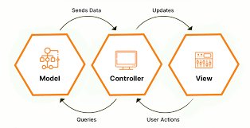

### MVC

La arquitectura MVC (`Model`-`View`-`Controller`) es uno de los patrones de diseño más populares en el desarrollo de aplicaciones web, y Laravel es un excelente ejemplo de un framework que sigue esta arquitectura. 

### Componentes de la Arquitectura MVC

- **Modelo (Model)**
  * **Responsabilidad**: El Modelo maneja la lógica de datos de la aplicación. Representa la estructura de los datos y proporciona métodos para interactuar con la base de datos.
  * **Tareas Principales**:
    * Definir la estructura de los datos, generalmente en forma de clases.
    * Gestionar la comunicación con la base de datos mediante Consultas SQL o ORMs (Object-Relational Mappers) como Eloquent en Laravel.
    * Aplicar reglas de negocio y validaciones.

- **Vista (View)**
  * **Responsabilidad**: La Vista se encarga de la presentación de los datos. Define cómo se muestra la información al usuario.
  * **Tareas Principales**:
    * Mostrar datos al usuario.
    * Recibir entradas del usuario.
    * Implementar templates que se pueden renderizar en el navegador.

- **Controlador (Controller)**
  * **Responsabilidad**: El Controlador actúa como un intermediario entre el Modelo y la Vista. Se encarga de procesar las solicitudes del usuario, manipular datos a través del Modelo y devolver una respuesta a la Vista.
  * Tareas Principales:
    * Recepcionar las solicitudes del usuario.
    * Interactuar con el Modelo para obtener o manipular datos.
    * Pasar o retornar datos a la Vista para su presentación

### Flujo de Datos

- **Solicitud del Usuario**: El usuario hace una solicitud a la aplicación web.
- **Enrutamiento**: El enrutador de Laravel (web.php o api.php) dirige la solicitud al Controlador adecuado.
- **Controlador**: El Controlador recibe la solicitud y decide qué Modelo utilizar. Obtiene datos del Modelo y decide qué Vista mostrar.
- **Modelo**: El Modelo interactúa con la base de datos y obtiene los datos necesarios.
- **Vista**: La Vista recibe los datos del Controlador y los presenta al usuario.
- **Respuesta al Usuario**: La Vista devuelve la respuesta final al usuario.
  

### Ventajas del Patrón MVC

- **Separación de Responsabilidades**: Cada componente tiene una responsabilidad única.
- **Facilita el Mantenimiento**: Los cambios en la lógica de negocio, la interfaz de usuario o la base de datos se pueden hacer de forma aislada.
- **Reutilización del Código**: Las vistas pueden ser reutilizadas para diferentes partes de la aplicación.
- **Testeo**: Los componentes se pueden probar de manera independiente.

### Buenas Prácticas en MVC
- **Modelos**: Mantén los modelos delgados. La lógica de negocio compleja debe estar en servicios o en la capa de dominio.
- **Vistas**: No incluyas lógica de negocio en las vistas; usa plantillas para la presentación.
- **Controladores**: Mantén los controladores delgados. Usa métodos de servicios para lógica de negocio.