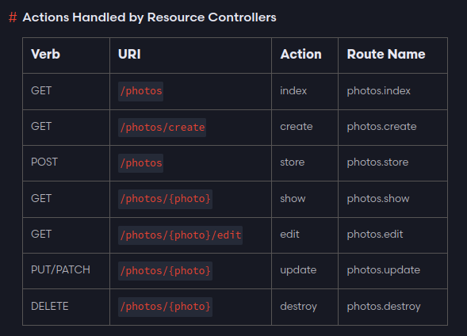

### Controladores

En Laravel, los controladores son una parte esencial del patrón de arquitectura MVC (Modelo-Vista-Controlador). Los controladores actúan como intermediarios entre los modelos y las vistas, gestionando la lógica de la aplicación, procesando las solicitudes HTTP, y retornando respuestas apropiadas.

### Creación de Controladores

**Convencion de nombres:**

- Uso de CamelCase
- Nombre descriptivo seguido de la palabra **Controller**
```php
php artisan make:controller UserController
```
Esto creará un controlador llamado `UserController` en el directorio `app/Http/Controllers`.

### Definiendo Métodos en el Controlador

Un controlador básico puede tener métodos para manejar diferentes solicitudes **HTTP** (`GET`, `POST`, `PUT`, `DELETE`).

**Ejemplo de un Controlador Básico**
```php
namespace App\Http\Controllers;

use Illuminate\Http\Request;

class UserController extends Controller
{
    // Maneja una solicitud GET a /users
    public function index()
    {
        // Lógica para mostrar una lista de usuarios
    }

    // Maneja una solicitud GET a /users/{id}
    public function show($id)
    {
        // Lógica para mostrar un usuario específico
    }

    // Maneja una solicitud POST a /users
    public function store(Request $request)
    {
        // Lógica para crear un nuevo usuario
    }
    // Maneja una solicitud PUT a /users/{id}/edit
    public function edit(Request $request, $id)
    {
      // Lógica para obtener los datos de un usuario existente
    }
    // Maneja una solicitud PUT a /users/{id}
    public function update(Request $request, $id)
    {
        // Lógica para actualizar un usuario existente
    }
    // Maneja una solicitud DELETE a /users/{id}
    public function destroy($id)
    {
        // Lógica para eliminar un usuario
    }
}
```
### Controller Resource

Un controlador de recursos es un tipo de controlador que se utiliza para crear controladores que manejan todas las operaciones CRUD (**Crear**, **Leer**, **Actualizar, Eliminar**) de manera más estructurada y siguiendo convenciones **RESTful**.

1. **Creación**
```php
php artisan make:controller ProductController --resource
```
Esto generará un controlador con métodos predeterminados para manejar operaciones **CRUD**:
```php
namespace App\Http\Controllers;

use Illuminate\Http\Request;

class ProductController extends Controller
{
    public function index()
    {
        // Mostrar una lista de recursos
    }

    public function create()
    {
        // Mostrar un formulario para crear un nuevo recurso
    }

    public function store(Request $request)
    {
        // Almacenar un nuevo recurso en la base de datos
    }

    public function show($id)
    {
        // Mostrar un recurso específico
    }

    public function edit($id)
    {
        // Mostrar un formulario para editar un recurso existente
    }

    public function update(Request $request, $id)
    {
        // Actualizar un recurso existente en la base de datos
    }

    public function destroy($id)
    {
        // Eliminar un recurso específico de la base de datos
    }
}
```
### Rutas para Controladores

Para asociar rutas a los métodos de un controlador, puedes usar el archivo `routes/web.php` o `routes/api.php`.

- **Definiendo Rutas Manualmente:**
```php
use App\Http\Controllers\UserController;

Route::get('/users', [UserController::class, 'index']);
Route::get('/users/{id}', [UserController::class, 'show']);
Route::post('/users', [UserController::class, 'store']);
Route::get('/users/{id}/edit',[UserController::class, 'edit'])
Route::put('/users/{id}', [UserController::class, 'update']);
Route::delete('/users/{id}', [UserController::class, 'destroy']);
```

### Route Resouce
Rutas automaticas con un **Controlador Resource**: Si tu controlador sigue las convenciones **RESTful**, puedes definir todas las rutas de una vez usando el método `resource`:
```php
Route::resource('photos', PhotosController::class);
```
Esto generará automáticamente las rutas para **index**, **create**, **store**, **show**, **edit, update, y destroy**.


Podemos sobreescribir el nombre de la ruta, parametros
```php
use App\Http\Controllers\PhotoController;
 
Route::resource('photos', PhotoController::class)->names([
    'create' => 'photos.build'
]);
Route::resource('users', AdminUserController::class)->parameters([
    'users' => 'admin_user'
]);
// /users/{admin_user}
```
### Controladores de Acciones Únicas
Laravel también permite crear controladores que manejan una sola acción. Son útiles para operaciones específicas como por ejemplo: mostrar un formulario de contacto o procesar un pago.

**Creación**
```php
php artisan make:controller ContactController --invokable
```
Esto generará un controlador con un solo método `__invoke`:
```php
namespace App\Http\Controllers;

use Illuminate\Http\Request;

class ContactController extends Controller
{
    public function __invoke(Request $request)
    {
        // Lógica para manejar la acción única
    }
}
```
Definiendo la Ruta para un Controlador de Acción Única:
```php
use App\Http\Controllers\ContactController;

Route::get('/contact', ContactController::class);
```

### Middlewares en Controladores
Puedes aplicar middlewares a los controladores para gestionar aspectos como la autenticación, autorización, y validación de solicitudes.

**Aplicar Middleware a un Controlador Completo:**
```php
namespace App\Http\Controllers;

use Illuminate\Http\Request;

class UserController extends Controller
{
    public function __construct()
    {
        $this->middleware('auth');
    }

    // Otros métodos del controlador...
}
```
**Aplicar Middleware a Métodos Específicos:**
```php
namespace App\Http\Controllers;

use Illuminate\Http\Request;

class UserController extends Controller
{
    public function __construct()
    {
        $this->middleware('auth')->only(['store', 'update', 'destroy']);
        $this->middleware('guest')->except(['store', 'update', 'destroy']);
    }

    // Otros métodos del controlador...
}
```

### Formas de realizar Operaciones CRUD

En Laravel, puedes realizar operaciones CRUD (Crear, Leer, Actualizar, Eliminar) sobre los modelos de varias maneras, utilizando tanto **métodos estáticos** como **instancias de los modelos**. Vamos a explorar estas operaciones con ejemplos.

1. **Crear un Registro**: 

- **Usando el Método `create`**: El método **create** permite crear un nuevo registro utilizando un array de atributos. **Nota** que este método requiere que los atributos sean marcados como "asignables en masa" (`$fillable`) en el modelo.
```php
public function create()
{
    User::create([
        "name" => "Alicia Mendez",
        "email" => "alicia@hotmail.com",
        "age" => 63,
        "password" => Hash::make('38387337'),
        "address" => "Malambo - Atlantico",
        "zip_code" => 7373
    ]);
}
```
- **Usando una Nueva Instancia del Modelo**: Otra forma de crear un registro es instanciando el modelo, asignando atributos y luego guardándolo.
```php
public function create()
{
    $user = new User();
    $user->name = "Jhaminton Mendez";
    $user->email = "thejjmendez@gmail.com";
    $user->password = Hash::make('password');
    $user->address = "Malambo - Atlantico";
    $user->zip_code = 23522;
    $user->save();
}
```

2. **Leer (Obtener) Registros**

- Obtener Todos los Registros
```php
public function index()
{
    $users = User::all();
    return $users;
}
```
- Obtener un Registro por ID
```php
public function show($id)
{
    $user = User::find($id);
    return $user;
}
```
- Obtener un Registro con Condiciones
```php
public function findByEmail($email)
{
    $user = User::where('email', $email)->first();
    return $user;
}
```

3. **Actualizar un Registro**
- **Usando el Método `update`**: Puedes actualizar un registro existente utilizando el método update en una instancia de modelo.
```php
public function update($id)
{
    $user = User::find($id);
    $user->update([
        'name' => 'Updated Name',
        'email' => 'updatedemail@example.com'
    ]);
}
```
- **Actualizando Atributos Individualmente y Guardando**: Otra forma de actualizar un registro es asignar atributos individualmente y luego llamar al método `save`.
```php
public function update($id)
{
    $user = User::find($id);
    $user->name = 'Updated Name';
    $user->email = 'updatedemail@example.com';
    $user->save();
}
```
4. **Eliminar un Registro**
- **Usando el Método `delete`**: Puedes eliminar un registro encontrándolo primero y luego llamando al método `delete`.
```php
public function delete($id)
{
    $user = User::find($id);
    $user->delete();
}
```
- **Eliminando Directamente por ID**: Otra forma de eliminar un registro es llamar al método destroy directamente con el ID.
```php
public function delete($id)
{
    User::destroy($id);
}
```
### Otras Operaciones Comunes
- **Actualizar o Crear un Registro `(updateOrCreate)`**: Este método intentará actualizar un registro existente o creará uno nuevo si no existe.
```php
public function updateOrCreateUser()
{
    $user = User::updateOrCreate(
        ['email' => 'thejjmendez@gmail.com'], // Condiciones de búsqueda
        [
            'name' => 'Jhaminton Mendez',
            'address' => 'Updated Address'
        ] // Atributos de actualización o creación
    );
}
```
- **Primero o Crear `(firstOrCreate)`**: Este método intentará encontrar un registro que coincida con las condiciones dadas. Si no lo encuentra, creará uno nuevo.
```php
public function firstOrCreateUser()
{
    $user = User::firstOrCreate(
        ['email' => 'thejjmendez@gmail.com'], // Condiciones de búsqueda
        ['name' => 'Jhaminton Mendez', 'address' => 'New Address'] // Atributos de creación
    );
}
```