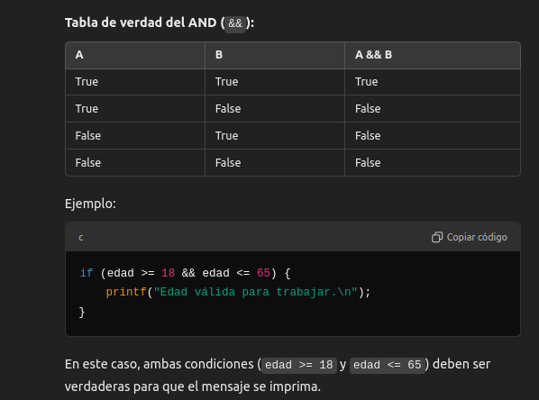
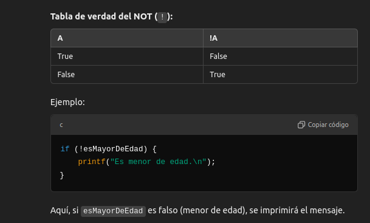

## Operadores Lógicos
Los operadores lógicos son operadores que permiten realizar operaciones entre expresiones booleanas (verdadero o falso) y devolver un resultado booleano. Se usan para combinar o modificar condiciones lógicas en el control del flujo del programa, como en estructuras condicionales (`if`, `while`, `for`, etc.).

En C, los operadores lógicos son tres principales:

* **AND lógico `&&`**: Devuelve verdadero si ambas expresiones son verdaderas.

* **OR lógico `||`**: Devuelve verdadero si al menos una de las expresiones es verdadera.

* **NOT lógico `!`**: Invierte el valor de verdad de la expresión; devuelve verdadero si la expresión es falsa, y viceversa.

### ¿Qué resuelven?
Los operadores lógicos resuelven el problema de combinar múltiples condiciones lógicas en una sola expresión. Esto permite hacer decisiones más complejas en tu programa. Por ejemplo, puedes verificar si un número está en un rango determinado o si una acción debe realizarse solo si se cumplen varias condiciones a la vez.

### ¿Cómo lo resuelven?
Los operadores lógicos combinan o invierten condiciones de la siguiente manera:

1. **`&&` (AND lógico)**:

   * Si ambas condiciones son verdaderas, el resultado es verdadero.
   * Si al menos una es falsa, el resultado es falso.



2. **`||` (OR lógico)**:

   * Si al menos una de las condiciones es verdadera, el resultado es verdadero.
   * Solo será falso si todas las condiciones son falsas.

      | A     | B     | A B   |
      | ----- | ----- | ----- |
      | True  | True  | True  |
      | True  | False | True  |
      | False | True  | True  |
      | False | False | False |

**Ejemplo**
```c
if (temperatura < 0 || temperatura > 35) {
    printf("Temperatura extrema.\n");
}-
```

3. ! (NOT lógico):

Invierte el valor de verdad de una condición.
Si una condición es verdadera, se convierte en falsa, y viceversa.



## Operador Ternario
El operador ternario en C es una forma concisa de expresar una condición y decidir entre dos valores basados en el resultado de dicha condición. Este operador está compuesto por tres partes, de ahí su nombre "ternario", y su sintaxis es la siguiente:

```c
(condición) ? valor_si_verdadero : valor_si_falso;
```
* **`condición`**: Es la expresión lógica o **booleana** que se evalúa.

* **`valor_si_verdadero`**: El valor que se devuelve o la expresión que se ejecuta si la condición es `true` (verdadera).

* **`valor_si_falso`**: El valor que se devuelve o la expresión que se ejecuta si la condición es `false` (falsa).

## Ejemplo de uso
El operador ternario es una alternativa al uso de una estructura if-else para asignar valores o ejecutar expresiones más concisas.

```c
int a = 10, b = 20;
int mayor;

mayor = (a > b) ? a : b;  // Si a > b, devuelve a; de lo contrario, devuelve b
printf("El mayor es: %d\n", mayor);
```

### ¿Qué resuelve el operador ternario?
El operador ternario resuelve la necesidad de hacer decisiones simples basadas en una condición sin la necesidad de escribir estructuras `if-else` más largas. Es útil cuando se desea escribir código más compacto y directo, sobre todo cuando se trata de expresiones simples.

### ¿Cómo lo resuelve?
El operador ternario lo resuelve al evaluar la condición lógica y ejecutar una de dos expresiones (dependiendo de si la condición es verdadera o falsa). Esencialmente, actúa como un `if-else` abreviado que puede ser utilizado dentro de una expresión o asignación.

### ¿Cuándo se utiliza?
El operador ternario se usa cuando:

* **Las condiciones son simples**: No se recomienda su uso en casos con lógica compleja, ya que puede disminuir la legibilidad del código.

* **Se busca brevedad**: Para operaciones sencillas que de otra manera requerirían un if-else completo.

* **Asignaciones rápidas**: Es ideal para realizar asignaciones de variables basadas en una condición.
