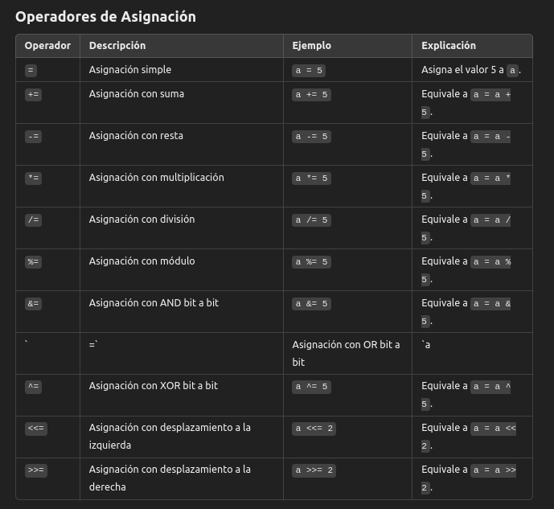

## Operadores de Incremento y Decremento
En C, los operadores de incremento y decremento son operadores unarios que modifican el valor de una variable numérica en 1 unidad. Estos operadores son:

* **Operador de incremento (++)**: Aumenta el valor de la variable en 1.

* **Operador de decremento (--)**: Disminuye el valor de la variable en 1.

Ambos operadores pueden aplicarse de dos formas:

1. **Forma prefija** (pre-incremento o pre-decremento)

2. **Forma postfija** (post-incremento o post-decremento)

### Operador de Incremento (++)
**Pre-incremento (++var)**

* La variable se incrementa antes de que se utilice en una expresión.
* Se evalúa primero el incremento, y luego el nuevo valor es utilizado.

**Ejemplo**
```c
int x = 5;
int y = ++5; // x se incrementa primero, luego y = 6 y x = 6
```
En este caso, el valor de x se incrementa a 6, y luego se asigna a y, por lo que y también es 6.

**Post-incremento (var++)**

* La variable se utiliza en la expresión, y después se incrementa.
* Se evalúa primero el valor actual de la variable, y luego se incrementa.

**Ejemplo**
```c
int x = 5;
int y = 5++;
```
En este caso, el valor de x se utiliza en la asignación a y (que es 5), y después x se incrementa a 6. Por lo tanto, y es 5 y x es 6.

### Operador de Decremento (--)
Pre-decremento (--var)
La variable se decrementa antes de que se utilice en una expresión.
Se evalúa primero el decremento, y luego el nuevo valor es utilizado.

Ejemplo
```c
int x = 5;
int y = --x;  // x se decrementa primero, luego y = 4 y x = 4
```
En este caso, el valor de x se decrementa a 4, y luego se asigna a y, por lo que y también es 4.

Post-decremento (var--)
La variable se utiliza en la expresión, y después se decrementa.
Se evalúa primero el valor actual de la variable, y luego se decrementa.

Ejemplo
```c
int x = 5;
int y = x--;  // y = 5, pero luego x se decrementa a 4
```
En este caso, el valor de x se utiliza en la asignación a y (que es 5), y después x se decrementa a 4. Por lo tanto, y es 5 y x es 4.

### ¿Qué resuelven?
Estos operadores son útiles para modificar valores de variables de manera compacta, en particular en estructuras de control como bucles. Son muy comunes en iteraciones, ya que permiten incrementar o decrementar contadores de forma eficiente y concisa.

### ¿Cómo lo resuelven?
Los operadores ++ y -- resuelven la necesidad de incrementar o decrementar el valor de una variable de manera compacta y eficiente, evitando la necesidad de escribir código más largo como x = x + 1 o x = x - 1. Además, facilitan operaciones en bucles y algoritmos de control, donde el ajuste del valor de una variable en 1 es una operación común.

## Operadores de Asignación
Los operadores de asignación en C se utilizan para asignar valores a las variables. El más básico es el operador = (asignación simple), pero también existen operadores compuestos que combinan la asignación con otros operadores aritméticos o bit a bit.



**Ejemplos**

* **Asignación Simple (`=`)**:
    ```c
    int a = 10;  // Asigna el valor 10 a la variable a
    ```

* **Asignación con Suma (`+=`)**:
    ```c
    int a = 10;
    a += 5;  // Equivalente a a = a + 5; ahora a será 15
    ```

* **Asignación con Resta (`-=`)**:
    ```c
    int a = 10;
    a -= 3;  // Equivalente a a = a - 3; ahora a será 7
    ```

* **Asignación con Multiplicación (`*=`)**:
    ```c
    int a = 4;
    a *= 3;  // Equivalente a a = a * 3; ahora a será 12
    ```

* **Asignación con División (`/=`)**:
    ```c
    int a = 10;
    a /= 2;  // Equivalente a a = a / 2; ahora a será 5
    ```

* **Asignación con Módulo (`%=`)**:
    ```c
    int a = 10;
    a %= 3;  // Equivalente a a = a % 3; ahora a será 1
    ```

## Operadores Aritmeticos
Los operadores aritméticos en **C** permiten realizar operaciones matemáticas sobre variables y literales numéricas. Son esenciales para llevar a cabo cálculos y manipulación de datos en un programa.

| Operador | Operación                | Ejemplo  | Resultado |
| -------- | ------------------------ | -------- | --------- |
| `+`      | Suma                     | `5 + 3`  | 8         |
| `-`      | Resta                    | `5 - 3`  | 2         |
| `*`      | Multiplicación           | `5 * 3`  | 15        |
| `/`      | División                 | `10 / 2` | 5         |
| `%`      | Módulo (residuo de div.) | `10 % 3` | 1         |


**Division**: 
  * Si trabajas con enteros, cualquier parte decimal será truncada.

  * Si quieres una división precisa con decimales, al menos uno de los operandos debe ser un número de punto flotante:

## Reglas de Precedencia de los Operadores en C
La precedencia de los operadores determina el orden en que las operaciones se ejecutan cuando hay varias en una misma expresión. Algunos operadores tienen mayor precedencia que otros, lo que afecta el resultado de las operaciones. Cuando dos operadores tienen la misma precedencia, se evalúan en el orden definido por su asociatividad (de izquierda a derecha o de derecha a izquierda).

| Operador              | Descripción                      | Precedencia | Asociatividad |
| --------------------- | -------------------------------- | ----------- | ------------- |
| `()`                  | Paréntesis                       |             |               |
| `++`, `--` (postfijo) | Post-incremento, post-decremento |             |               |
| `+`, `-` (unario)     | Positivo, Negativo               |             |               |
| `*`, `/`, `%`         | Multiplicación, División, Módulo |             |               |
| `+`, `-`              | Suma, Resta                      |             |               |

1. **Paréntesis `()`**: Tienen la precedencia más alta, por lo que cualquier operación dentro de paréntesis se evalúa primero. Esto es útil para alterar el orden de evaluación predeterminado.

    ```c
    int result = (2 + 3) * 4; // Primero se suma 2 + 3, luego se multiplica el resultado por 4. Resulta: 20
    ```

2. **Post-incremento y Post-decremento `++`, `--`**: Son evaluados después de cualquier otra operación en la expresión.

    ```c
    int a = 5;
    int b = a++;  // b = 5, pero luego a = 6
    ```

3. **Operadores unarios `+`, `-`**: Se aplican directamente al valor de una variable para indicar si es positiva o negativa.

    ```c
    int a = -5;
    ```

4. **Multiplicación, División y Módulo `*`, `/`, `%`**: Tienen mayor precedencia que la suma y resta. Por lo tanto, se evalúan antes en una expresión.

    ```c
    int result = 5 + 2 * 3;  // Primero se evalúa 2 * 3, luego se suma 5. Resultado: 11
    ```

5. **Suma y Resta `+`, `-`**: Son evaluadas después de la multiplicación, división y módulo.

    ```c
    int result = 5 - 2 + 3;  // Se evalúa de izquierda a derecha: 5 - 2 = 3, luego 3 + 3 = 6
    ```

### Asociatividad
Cuando los operadores tienen la misma precedencia, se evalúan según su asociatividad:

* **Izquierda a derecha**: La mayoría de los operadores (como `+`, `-`, `*`, `/`, `%`) se evalúan de izquierda a derecha.

    ```c
    int result = 10 / 2 * 3;  // Se evalúa de izquierda a derecha: (10 / 2) * 3 = 15
    ```

* **Derecha a izquierda**: Algunos operadores como el incremento y decremento unario (`++`, `--` en prefijo) o el operador de asignación `=` tienen una asociatividad de derecha a izquierda.

    ```c
    int a;
    a = 5 + 3;  // Primero se evalúa 5 + 3, luego se asigna el resultado a a.
    ```