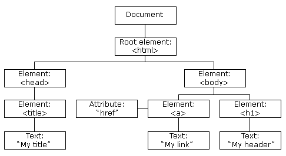

# Document Object Model
El DOM (Document Object Model) es una interfaz de programación que representa la estructura de un documento HTML o XML como una jerarquía de objetos. Al cargar una página web, el navegador crea un modelo estructural del contenido del documento, lo que permite a los desarrolladores manipular su estructura, estilo y contenido mediante JavaScript. Esto es crucial para crear páginas web interactivas y dinámicas.



## ¿Qué es el DOM?
El DOM es una representación estructurada del documento en forma de árbol, donde cada nodo representa una parte del documento:

* Etiquetas HTML como `<div>`, `<p>`, `<a>` son nodos de elemento.

* Texto dentro de las etiquetas HTML es un nodo de texto.

* Atributos como `id` o `class` también son representados como nodos.

## ¿Para qué sirve el DOM?
El DOM sirve como un puente entre el contenido de una página web y JavaScript, permitiendo manipular y modificar el contenido, el diseño y el comportamiento de la página en tiempo real. Los cambios que realizamos en el DOM se reflejan inmediatamente en la página mostrada en el navegador.

## ¿Qué resuelve el DOM?
El DOM permite resolver la necesidad de interactividad y dinamismo en las páginas web. Gracias al DOM:

* **Podemos modificar el contenido**: Cambiar texto, añadir o quitar elementos HTML, actualizar imágenes, etc.

* **Podemos cambiar el diseño**: Modificar estilos en línea o clases CSS para alterar visualmente la página.

* **Podemos manipular eventos**: Capturar interacciones del usuario (como clics o desplazamientos) para desencadenar acciones.

## ¿Cómo lo resuelve el DOM?
El DOM se integra con JavaScript y otros lenguajes de scripting para acceder y manipular los elementos de una página web. Las operaciones en el DOM se logran mediante varios métodos y propiedades que permiten seleccionar, modificar y gestionar el contenido del documento.

## Elementos Clave del DOM en JavaScript
1. Acceso a Elementos

* **`document.getElementById(id)`**: Selecciona un elemento por su id.

* **`document.getElementsByClassName(className)`**: Selecciona todos los elementos con una clase específica.

* **`document.getElementsByTagName(tagName)`**: Selecciona todos los elementos de un tipo específico (como <p> o <div>).

* **`document.querySelector(selector)`**: Selecciona el primer elemento que coincide con un selector CSS.

* **`document.querySelectorAll(selector)`**: Selecciona todos los elementos que coinciden con un selector CSS.

**Ejemplo**
```js
const titulo = document.getElementById("mi-titulo");
const botones = document.querySelectorAll(".boton");
```

2. **Manipulación de Contenido**

* **`element.innerHTML`**: Cambia el contenido HTML de un elemento.

* **`element.textContent`**: Cambia solo el texto de un elemento, ignorando el HTML.

* **`element.setAttribute(attr, value)`**: Establece un atributo en el elemento.

* **`element.removeAttribute(attr)`**: Elimina un atributo del elemento.


**Ejemplo**
```js
titulo.textContent = "Nuevo título";
titulo.setAttribute("class", "titulo-destacado");
```

3. Manipulación de Estructura

* **`document.createElement(tagName)`**: Crea un nuevo elemento en el DOM.

* **`element.appendChild(childElement)`**: Añade un elemento hijo al final de otro elemento.

* **`element.removeChild(childElement)`**: Elimina un elemento hijo.

* **`element.insertBefore(newElement, referenceElement)`**: Inserta un elemento antes de otro específico.

**Ejemplo**
```js
const nuevoParrafo = document.createElement("p");
nuevoParrafo.textContent = "Este es un nuevo párrafo.";
document.body.appendChild(nuevoParrafo);
```

4. **Eventos en el DOM**: Permiten detectar y responder a las interacciones del usuario.

* **`element.addEventListener(event, function)`**: Añade un controlador para un evento específico.

* **`element.removeEventListener(event, function)`**: Elimina un controlador de evento específico.

**Ejemplo**
```js
titulo.addEventListener("click", () => {
    alert("¡Has hecho clic en el título!");
});
```

## Buenas Prácticas en el uso del DOM
1. **Minimizar Manipulaciones Directas**: Acceder o modificar el DOM muchas veces puede ser costoso en términos de rendimiento. Es mejor realizar todos los cambios necesarios en una sola operación cuando sea posible.

2. **Usar Fragmentos del DOM**: Cuando añadimos múltiples elementos, crear un `DocumentFragment` permite construir elementos sin desencadenar renderizados intermedios.

Ejemplo:
```js
const fragment = document.createDocumentFragment();
for (let i = 0; i < 10; i++) {
    const nuevoDiv = document.createElement("div");
    nuevoDiv.textContent = `Elemento ${i}`;
    fragment.appendChild(nuevoDiv);
}
document.body.appendChild(fragment);
```

3. **Evitar `innerHTML` para Introducir Contenido Dinámico**: Usar innerHTML puede ser vulnerable a ataques de **XSS (cross-site scripting)**. Para agregar texto, textContent es una opción más segura.