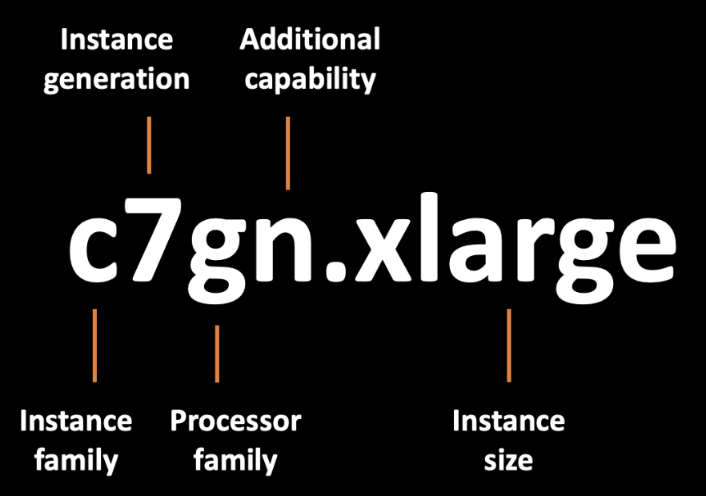

## Elastic Computed Cloud
Amazon EC2 (Elastic Compute Cloud) es uno de los servicios más importantes de AWS, diseñado para proporcionar capacidad de cómputo escalable y flexible en la nube. Este servicio permite a los usuarios desplegar y gestionar máquinas virtuales (denominadas "instancias") en la infraestructura de AWS, lo que facilita el acceso a recursos de computación según sea necesario.

## Instances
Las instancias en Amazon EC2 son máquinas virtuales que puedes lanzar y gestionar en la infraestructura de AWS. Una instancia es, en esencia, una unidad de computación en la nube que proporciona recursos como CPU, memoria, almacenamiento y redes, y que funciona como un **servidor virtual**.

### Características de las Instancias en EC2:
1. **Capacidad de Cómputo Virtual**:

   * Una instancia actúa como un servidor virtual que puedes configurar con un sistema operativo (Linux o Windows) y en el que puedes instalar aplicaciones o servicios, tal como lo harías en un servidor físico.

2. **Tipos de Instancias**:

   * Existen diferentes tipos de instancias optimizadas para varios casos de uso:

   * **General Purpose**: Balance entre CPU, memoria y redes (ej. `t3`, `m5`).

   * **Compute Optimized:** Más CPU para tareas de procesamiento intensivo (ej. `c5`).

   * **Memory Optimized**: Mayor cantidad de memoria para aplicaciones que requieren muchos datos en memoria (ej. `r5`).

   * **Storage Optimized**: Diseñadas para grandes volúmenes de datos o IOPS (ej. `i3`).

3. **Personalización**: Las instancias pueden personalizarse según tus necesidades, seleccionando la cantidad de CPU, memoria, almacenamiento y otros recursos.

4. **Persistencia de Datos**: Las instancias pueden conectarse a volúmenes **EBS** para almacenamiento persistente, o usar almacenamiento efímero que se elimina al detener o finalizar la instancia.

5. **Pago por Uso**: Solo pagas por el tiempo en que las instancias están activas, y puedes iniciarlas, detenerlas o terminarlas en cualquier momento según las necesidades de tu aplicación.

### Usos Comunes de las Instancias:
* Alojar aplicaciones web y servicios.

* Desplegar bases de datos.

* Realizar tareas de procesamiento intensivo, como análisis de datos o simulaciones científicas.

* Ejecutar aplicaciones empresariales en entornos virtuales.

## Instaces Types
Los Instance Types (tipos de instancias) en Amazon EC2 son diferentes configuraciones de máquinas virtuales que proporcionan varios niveles de capacidad de cómputo, memoria, almacenamiento y redes. Cada tipo de instancia está diseñado para diferentes casos de uso, lo que te permite seleccionar la mejor combinación de recursos para tus necesidades.

### Instance Type Naming Convention



La convención de nomenclatura de los tipos de instancias en Amazon EC2 sigue un esquema estandarizado que facilita la identificación de las características clave de cada instancia. Esta convención permite entender rápidamente el tipo de instancia, su propósito, generación, y características específicas como el almacenamiento y la red.

Un tipo de instancia en AWS se define mediante una estructura que sigue el siguiente formato:

```php
<familia><tipo de hardware>.<generación><calificador opcional>
```

### Estructura de un Tipo de Instancia
Cada parte del nombre tiene un significado específico:

1. **Familia de Instancias**:

   * Define el propósito general de la instancia, como si está optimizada para cómputo, memoria, almacenamiento, uso general, etc.

2. **Tipo de Hardware**:

   * Indica si la instancia está optimizada para el uso de cómputo, memoria, GPU, almacenamiento, etc.

3. **Generación**:

   * Es un número que indica la versión o generación de la instancia. Las generaciones más altas (por ejemplo, `m6`, `c6`, `r6`) suelen tener un mejor rendimiento o costo-beneficio en comparación con versiones anteriores.

4. **Calificador Opcional**:

   * Algunos tipos de instancia incluyen un calificador que aporta información adicional sobre las características específicas de la instancia, como un rendimiento optimizado en la red o el uso de almacenamiento basado en NVMe.

### Ejemplo de Nombres de Instancia
Consideremos el siguiente nombre de instancia:

```bash
m5.large
```
* `m`: Indica la familia generalista, ideal para aplicaciones balanceadas en cómputo, memoria y almacenamiento.

* `5`: Es la generación, lo que indica que pertenece a la quinta generación de la familia M.

* `.large`: Especifica el tamaño de la instancia, en este caso, `large` es un tamaño intermedio dentro de las opciones.

**Otro ejemplo más complejo**
```bash
r5d.4xlarge
```
* `r`: La familia está optimizada para uso intensivo de memoria.

* `5`: Indica que es de la quinta generación de la familia R.

* `d`: Calificador adicional que indica que incluye almacenamiento local con NVMe (Instance Store).

* `.4xlarge`: Especifica que es una instancia de tamaño 4xlarge, que proporciona más vCPU y memoria que versiones más pequeñas.

### Familia de Instancias
Las familias de instancias representan la optimización del tipo de instancia para diferentes tipos de cargas de trabajo:

* **`t` (Burstable)**: Ideal para cargas de trabajo con demanda variable que requieren ráfagas de rendimiento, como t3.micro.

* **`m` (Uso general)**: Equilibrio entre CPU, memoria y almacenamiento, ideal para aplicaciones comunes, como m5.large.

* **`c` (Optimizado para cómputo)**: Enfocado en tareas que requieren alto rendimiento de CPU, como c6g.xlarge.

* **`r` (Optimizado para memoria)**: Ideal para aplicaciones que requieren grandes cantidades de memoria, como r5d.2xlarge.

* **`x` (Memoria extendida)**: Diseñado para cargas de trabajo que requieren memoria masiva, como x2idn.metal.

* **`i` (Optimizado para almacenamiento)**: Enfocado en aplicaciones que necesitan un almacenamiento rápido y con alta IOPS, como i3en.large.

* **`g` (Optimizado para gráficos/GPU)**: Equipado con GPU para cargas de trabajo gráficas o de machine learning, como g5.xlarge.

### Generación
La generación es el número que indica la versión de la familia de instancias. AWS lanza nuevas generaciones para mejorar la eficiencia de costo, rendimiento y capacidades.

* **Por ejemplo**, `c4.large` pertenece a una generación anterior, mientras que c6g.large es más reciente y usa procesadores **Graviton2** basados en ARM, lo que puede ofrecer mejor rendimiento y menor costo.

### Tamaño (Tiers)
El tamaño de la instancia se especifica al final del nombre (después del punto) e indica la cantidad de recursos (vCPU, memoria, etc.) asignados a la instancia. Algunos ejemplos de tamaños comunes:

* `nano`: El más pequeño, con una fracción de vCPU y poca memoria.

* `micro`: Un tamaño pequeño adecuado para cargas de trabajo ligeras.

* `small`, `medium`, `large`: Tienen más capacidad progresivamente.

* `xlarge`, `2xlarge`, `4xlarge`: Escalando hasta tamaños muy grandes, con muchas vCPU y memoria.

###  Calificadores Opcionales
Algunos tipos de instancias incluyen calificadores opcionales que proporcionan información adicional sobre sus características específicas. Algunos de los más comunes son:

* `a`: Utiliza procesadores AMD EPYC, por ejemplo, m5a.large.

* `d`: Tiene almacenamiento local basado en NVMe (Instance Store), por ejemplo, m5d.xlarge.

* `g`: Utiliza procesadores AWS Graviton, como m6g.large.

* `n`: Optimizado para redes con mayor ancho de banda, como c5n.large.

* `metal`: Indica una instancia bare metal (sin hipervisor), como i3.metal.

### Categorías Principales de Tipos de Instancias en EC2
1. General Purpose (Propósito General):

   * Estas instancias ofrecen un equilibrio entre cómputo, memoria y recursos de red, y son ideales para aplicaciones que necesitan una combinación equilibrada de estos recursos.

   * **Casos de uso**: Servidores web, entornos de desarrollo y aplicaciones que no sean intensivas en CPU o memoria.

   * **Ejemplos**
     
     * `t3`, `t4g` (eficientes en costo, escalables con burst)
     
     * `m5`, `m6g` (balance entre CPU y memoria)

2. **Compute Optimized (Optimizadas para Cómputo)**:

   * Estas instancias están diseñadas para aplicaciones que necesitan un alto rendimiento de CPU, ideal para tareas que requieren procesamiento intensivo.

   * **Casos de uso**: Procesamiento por lotes, servidores de juegos, servidores web de alto rendimiento, cargas de trabajo de machine learning.

   * **Ejemplos**:
     
     * `c5`, `c6g`

3. **Memory Optimized (Optimizadas para Memoria)**:

   * Están diseñadas para aplicaciones que requieren una gran cantidad de memoria en relación con la CPU, como bases de datos en memoria o análisis de big data.

   * Casos de uso: Bases de datos de alto rendimiento, caches en memoria como Redis o Memcached.

   * **Ejemplos**:
     
     * `r5`, `r6g`

     * `x1e`, **`x2gd` (grandes volúmenes de memoria)**

4. **Storage Optimized (Optimizadas para Almacenamiento)**:

   * Estas instancias están optimizadas para tareas que requieren un alto rendimiento de entrada/salida (IOPS) y grandes volúmenes de almacenamiento local. Son ideales para aplicaciones que requieren acceder a grandes volúmenes de datos en discos rápidos.

   * **Casos de uso**: Bases de datos NoSQL, procesamiento de big data, almacenamiento distribuido.

   * **Ejemplos**:

     * `i3`, **`i4i` (almacenamiento de alto rendimiento)**

     * `d2`, **`d3` (almacenamiento masivo en disco duro)**

5. **Accelerated Computing (Optimización con Aceleradores)**:

   * Estas instancias proporcionan GPUs o FPGAs para acelerar tareas de computación intensiva, como renderizado gráfico o entrenamiento de modelos de machine learning.

   * **Casos de uso**: Modelos de machine learning, simulaciones científicas, computación gráfica.

   * **Ejemplos**:
     
     * `p4`, `p3` (GPU para machine learning)

     * `g5`, `g4dn` (GPU para renderizado gráfico o inferencia de IA)

     * `f1` (FPGAs para tareas personalizadas de hardware

6. **High Memory (Memoria Alta)**:

   * Estas instancias están diseñadas para aplicaciones que requieren una enorme cantidad de memoria, como bases de datos SAP HANA y cargas de trabajo de análisis en memoria.

   * Ejemplos:

     * `u-6tb1`, `u-9tb1` (para grandes bases de datos)

### Factores a Considerar al Elegir un Tipo de Instancia
1. **Requisitos de Cómputo**:

   * Si tu aplicación es intensiva en procesamiento, como cálculos matemáticos o renderizado, considera instancias compute-optimized.

2. **Memoria**:

   * Para aplicaciones que manejan grandes volúmenes de datos en memoria, como bases de datos en tiempo real, utiliza memory-optimized.

3. **Almacenamiento**:

   * Si tu carga de trabajo implica leer y escribir grandes volúmenes de datos rápidamente, elige storage-optimized.

4. **Costo**:

   * Para cargas de trabajo impredecibles, donde no necesitas mucha capacidad continuamente, las instancias burstable (t3) pueden ser una opción eficiente en costos.

5. **Escalabilidad**:

   * EC2 permite cambiar de tipo de instancia a medida que evolucionan tus necesidades. Puedes comenzar con una instancia pequeña y, a medida que tu aplicación crece, cambiar a una más grande.

## Instance Purchasing Options
En Amazon EC2, existen diversas opciones de compra de instancias que te permiten ajustar el costo y la flexibilidad de acuerdo con tus necesidades específicas. AWS ofrece distintos modelos de pago para maximizar la eficiencia de los costos según el uso previsto de las instancias.

### **1. On-Demand Instances (Instancias bajo demanda)**

Las instancias On-Demand te permiten pagar por capacidad de cómputo por segundo o por hora sin necesidad de comprometerte a largo plazo. Este modelo es ideal para aplicaciones con cargas de trabajo impredecibles o que no pueden ser interrumpidas.

* **Características clave**:

  * No se requiere un pago inicial ni compromiso a largo plazo.

  * Pagas solo por el tiempo que la instancia está en ejecución (por segundo o por hora, dependiendo del tipo de instancia).

  * Adecuado para cargas de trabajo esporádicas, picos de demanda o aplicaciones con un ciclo de vida corto.

  * Costos más altos en comparación con otras opciones, pero con máxima flexibilidad.

* **Casos de uso**:

  * Aplicaciones con carga de trabajo variable e impredecible.

  * Pruebas y desarrollo de nuevas aplicaciones.

  * Usuarios que prefieren no hacer compromisos a largo plazo o pagar por adelantado.

### **2. Reserved Instances (Instancias reservadas)**
Las Reserved Instances (RIs) te permiten hacer una reserva de capacidad y obtener un descuento significativo a cambio de un compromiso de uno o tres años. Este modelo es ideal para aplicaciones con uso predecible y de largo plazo.

* **Características clave**:

  * Ofrecen descuentos de hasta el 75% comparado con las instancias On-Demand.

  * Existen tres tipos de pagos: All Upfront (Pago total por adelantado), Partial Upfront (Pago parcial por adelantado) y No Upfront (Sin pago inicial).

  * Puedes elegir entre RIs Estándar (que ofrecen los mayores descuentos) y RIs Conversibles (que permiten cambiar la configuración de la instancia).

  * Ideal para aplicaciones estables y de largo plazo con un uso predecible.

* **Casos de uso**:

  * Aplicaciones que funcionan 24/7 durante largos periodos.

  * Bases de datos y servidores de aplicaciones.

  * Servicios críticos de negocio con un patrón de uso constante.

### **3. Savings Plans (Planes de ahorro)**
Los Savings Plans ofrecen una alternativa flexible a las instancias reservadas. A cambio de un compromiso de gasto por hora durante uno o tres años, AWS te otorga descuentos significativos, de manera similar a las Reserved Instances, pero con más flexibilidad en cómo se aplican esos descuentos.

* **Características clave**:

  * Compromiso de gasto en USD/hora durante uno o tres años.

  * Mayor flexibilidad que las Reserved Instances, ya que puedes aplicar el plan de ahorro a diferentes tipos de instancias, tamaños, y regiones.

  * Dos tipos de Savings Plans: Compute Savings Plans (más flexibles, se aplican a EC2, Fargate y Lambda) y EC2 Instance Savings Plans (aplican descuentos para instancias específicas).

* **Casos de uso**:

  * Empresas que desean un modelo flexible para optimizar costos sin estar atadas a un tipo de instancia específico.

  * Cargas de trabajo cambiantes, pero con un uso constante.

### **4. Spot Instances (Instancias Spot)**
Las Spot Instances te permiten aprovechar capacidad no utilizada de EC2 a precios significativamente reducidos (hasta un 90% de descuento en comparación con On-Demand). AWS puede interrumpir las instancias Spot con un aviso de 2 minutos si la capacidad es necesaria para instancias On-Demand.

* **Características clave**:

  * Precios dinámicos que dependen de la oferta y la demanda de la capacidad no utilizada de EC2.

  * AWS puede detener, reiniciar o terminar una instancia Spot con un aviso de 2 minutos.

  * Ideal para cargas de trabajo que toleran interrupciones.

  * Gran ahorro en costos si puedes manejar interrupciones ocasionales.

* **Casos de uso**:

  * Procesamiento por lotes, análisis de datos masivos (Big Data).

  * Renderizado, simulaciones, y procesamiento en paralelo.

  * Pruebas de software distribuidas y tareas de computación de alto rendimiento (HPC).

### **5. Dedicated Hosts (Hosts dedicados)**
Los Dedicated Hosts proporcionan servidores físicos dedicados a ti, lo que te permite ejecutar instancias EC2 en hardware reservado exclusivamente para tu uso. Esto te permite cumplir con regulaciones y licencias que requieren servidores físicos dedicados.

* **Características clave**:

  * Servidores físicos completos dedicados a un solo cliente.

  * Ayuda a cumplir con normativas que requieren entornos dedicados.

  * Puedes utilizar tus propias licencias de software, como licencias de Windows Server o SQL Server.

  * Alta capacidad de personalización, ya que controlas directamente la configuración del host.

* **Casos de uso**:

  * Cumplimiento de regulaciones y normativas de seguridad.

  * Aplicaciones que requieren licencias de software que necesitan estar en servidores físicos dedicados.

  * Consolidación de servidores antiguos y aplicaciones empresariales críticas.

### Dedicated Instances (Instancias dedicadas)
Las Dedicated Instances son instancias de EC2 que se ejecutan en hardware dedicado a un solo cliente. A diferencia de los Dedicated Hosts, no te permiten el control sobre el servidor físico subyacente.

* **Características clave**:

  * Ejecutadas en hardware físico exclusivo para un solo cliente, lo que garantiza que tus instancias no compartirán hardware con otras cuentas de AWS.

  * No proporciona el mismo nivel de visibilidad y control que un Dedicated Host.

  * Se facturan como instancias On-Demand, pero con un costo adicional por servidor dedicado.

* **Casos de uso**:

  * Cargas de trabajo que requieren aislamiento a nivel físico pero que no necesitan control total del servidor.

  * Cumplimiento normativo o de seguridad que exige hardware dedicado.

### Capacity Reservations (Reservas de Capacidad)
Las Capacity Reservations te permiten reservar capacidad en una zona de disponibilidad específica por un período de tiempo determinado, garantizando que podrás lanzar instancias EC2 cuando las necesites. Esto es útil para cargas de trabajo críticas que requieren capacidad garantizada en momentos específicos.

* **Características clave**:

  * Garantía de que siempre habrá capacidad disponible en una zona de disponibilidad específica.

  * Se puede utilizar con instancias On-Demand, Reserved Instances o Savings Plans.

  * Puedes crear y gestionar Capacity Reservations de manera flexible a medida que tus necesidades cambian.

* **Casos de uso**:

  * Aplicaciones críticas que deben ejecutarse en un horario específico.

  * Evitar el riesgo de falta de capacidad en zonas de disponibilidad específicas durante picos de demanda.

## Security Groups
Los Security Groups en Amazon EC2 son un componente fundamental de la seguridad en la nube de AWS. Funcionan como cortafuegos virtuales a nivel de instancia, controlando el tráfico de red entrante y saliente para una o más instancias EC2. Los Security Groups permiten definir reglas que permiten o deniegan el tráfico basado en diferentes parámetros, como el puerto, el protocolo, y las direcciones IP de origen o destino.

### Características Clave de los Security Groups:
1. **Stateful (Conservan Estado)**:

   * Los Security Groups son **stateful**, lo que significa que si permites una conexión entrante a través de un puerto específico, la respuesta saliente a esa conexión se permite automáticamente, y viceversa. No es necesario especificar reglas de salida separadas para permitir la respuesta al tráfico entrante permitido.

2. **Control Granular**:

   * Puedes definir reglas que especifiquen protocolos, puertos y rangos de direcciones IP para permitir o denegar el tráfico.

   * Por ejemplo, puedes crear una regla para permitir solo el tráfico HTTP (puerto 80) desde un rango específico de direcciones IP.

3. **Reglas de Inbound y Outbound**:

   * **Inbound Rules** (Reglas de entrada): Estas controlan el tráfico entrante a la instancia. Por ejemplo, podrías configurar una regla para permitir tráfico SSH (puerto 22) desde una dirección IP específica.

   * **Outbound Rules** (Reglas de salida): Estas controlan el tráfico saliente desde la instancia. Por ejemplo, podrías configurar una regla para permitir todo el tráfico saliente hacia Internet o hacia una red específica.

4, **Por Defecto, Todo Está Denegado**:

   * Por defecto, todas las conexiones entrantes están denegadas en un Security Group recién creado, mientras que todas las conexiones salientes están permitidas. Esto significa que debes definir explícitamente qué tráfico entrante deseas permitir.

5. **Aplicación en Tiempo Real**:

   * Los cambios en los Security Groups se aplican en tiempo real. No es necesario reiniciar las instancias EC2 para que los cambios surtan efecto.

6. **Asociación Flexible**:

   * Un Security Group se puede asociar a múltiples instancias EC2. A su vez, una instancia EC2 puede tener uno o más Security Groups asociados.

   * Esto permite gestionar el tráfico para grupos de instancias que requieren el mismo nivel de seguridad o que cumplen una función similar.

7. **Reglas de Referencia a Otros Security Groups**:

   * Puedes crear reglas que permitan tráfico desde instancias asociadas a otros Security Groups. Esto es útil para permitir que instancias dentro de un grupo de aplicaciones se comuniquen entre sí mientras mantienen el tráfico restringido desde otras fuentes.

### Ejemplo de Configuración de Security Group:
Supongamos que tienes una aplicación web en AWS y deseas configurar la seguridad para que:

* Permita tráfico HTTP y HTTPS desde cualquier dirección IP (para que la aplicación sea accesible desde cualquier lugar).

* Permita tráfico SSH solo desde la dirección IP de tu oficina (para tareas de administración).

* Permita tráfico de bases de datos solo entre la instancia de la aplicación y la instancia de la base de datos.

* Puedes configurar un Security Group con las siguientes reglas:

**Inbound Rules**
| Protocolo | Puerto | Origen                       | Descripcion                                             |
| --------- | ------ | ---------------------------- | ------------------------------------------------------- |
| TCP       | 80     | 0.0.0.0/0                    | Permitir tráfico HTTP                                   |
| TCP       | 443    | 0.0.0.0/0                    | Permitir tráfico HTTPS                                  |
| TCP       | 22     | [IP de tu oficina]           | Permitir tráfico SSH                                    |
| TCP       | 3306   | [Security Group ID de la DB] | Permitir tráfico MySQL desde la instancia de aplicación |
**Outbund Rules**
| Protocolo | Puerto | Origen    | Descripcion                       |
| --------- | ------ | --------- | --------------------------------- |
| All       | All    | 0.0.0.0/0 | Permitir todo el tráfico saliente |


### Casos de Uso Comunes para Security Groups:
1. **Asegurar Aplicaciones Web**:

   * Permitir solo tráfico HTTP/HTTPS entrante y denegar todo lo demás, excepto el tráfico necesario para la administración (como SSH).

2. **Aislamiento de Bases de Datos**:

   * Permitir solo tráfico desde instancias de la aplicación a la base de datos, restringiendo el acceso a otros.

3. **Configuración de Bastiones (Bastion Hosts)**:

   * Permitir solo acceso SSH desde un Bastion Host a otras instancias, reforzando la seguridad de la infraestructura.

4. **Zonas Desmilitarizadas (DMZ)**:

   * Controlar el acceso entre diferentes zonas de seguridad (por ejemplo, público, privado) dentro de la misma red.