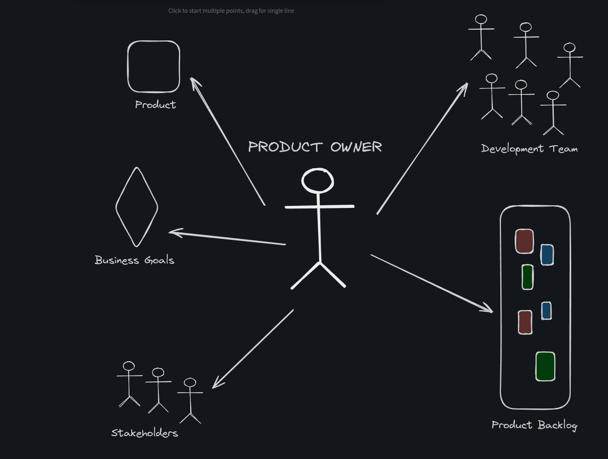
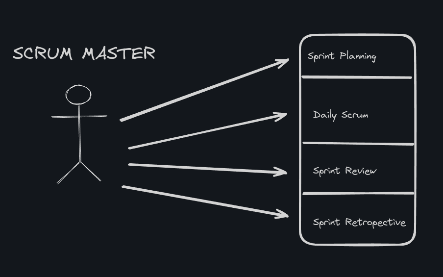

## SCRUM
Scrum es una metodología ágil de gestión de proyectos que se utiliza principalmente en el desarrollo de software, aunque puede aplicarse a otros campos. Se basa en un conjunto de principios y prácticas que permiten a los equipos trabajar de manera más eficiente y efectiva. 

## Principios Fundamentales de Scrum
1. **Iteraciones Cortas y Fijas (Sprints)**:
   * Los proyectos se dividen en periodos de tiempo cortos y repetitivos llamados sprints, que suelen durar entre 1 a 4 semanas.
   
   * Cada sprint tiene un objetivo claro y específico, con entregables funcionales al final de cada iteración.

2. **Transparencia**:
   * Todos los aspectos del proceso deben ser visibles para todos los involucrados.

   * Se utilizan artefactos y ceremonias estándar para asegurar la claridad y la transparencia del trabajo.

3. **Inspección y Adaptación**:
   * El progreso y los procesos se inspeccionan regularmente para detectar variaciones no deseadas.

   * Se realizan ajustes y mejoras continuas basadas en los hallazgos de estas inspecciones.

## Componentes Clave de Scrum

### Roles

1. **Product Owner (Propietario del Producto)**:
- **Responsabilidades**:
  * Definir y gestionar el **Product Backlog** (lista priorizada de requisitos y tareas).
  
  * Asegurar que el equipo trabaje en las tareas más importantes y que agregan más valor.
  
  * Establecer y comunicar la visión del producto al equipo y a los **stakeholders**.
  
  * Tomar decisiones sobre el alcance y la prioridad de los requisitos.
  
  * Aceptar o rechazar el trabajo completado.

- **Características**:
  * Fuerte conocimiento del producto y del mercado.
  
  * Habilidad para tomar decisiones y comunicarlas claramente.
  
  * Disponible para el equipo y los stakeholders.

2. **Scrum Master**:
- **Responsabilidades**:
   * Facilitar las reuniones y ceremonias de Scrum (**Sprint Planning**, **Daily Scrum**, **Sprint Review**, **Sprint Retrospective**).

   * Eliminar impedimentos que bloquean el progreso del equipo.

   * Ayudar al equipo a adherirse a las prácticas y principios ágiles.

   * Proteger al equipo de distracciones externas.

   * Facilitar la comunicación y la colaboración dentro del equipo y con los stakeholders.

- **Características**:
  * Buenas habilidades de facilitación y comunicación.
  * Conocimiento profundo de Scrum y de las prácticas ágiles.
  * Capacidad para resolver conflictos y problemas.

3. **Development Team (Equipo de Desarrollo)**:
- **Responsabilidades**:
  * Desarrollar y entregar incrementos de producto funcionales y de alta calidad en cada sprint.
  * Colaborar en la planificación del sprint y comprometerse con los objetivos del sprint.
  * Autoorganizarse para determinar la mejor manera de realizar el trabajo.
  * Participar en las reuniones de Scrum y en las actividades de mejora continua.

- **Características**:
  * Multifuncional, con habilidades diversas (desarrolladores, testers, diseñadores, etc.).
  * Comprometido con la entrega de valor.
  * Autónomo y colaborativo.

### Artefactos

1. **Product Backlog**:
   * Lista priorizada de todo el trabajo que podría ser necesario en el producto.
   * Constantemente refinado y actualizado por el **Product Owner**.

2. **Sprint Backlog**:
   * Conjunto de elementos del **Product Backlog** seleccionados para trabajar durante el **sprint** actual.
  
   * Incluye un plan detallado para entregar el incremento del producto.

3. **Increment**:
   * Resultado de un sprint que debe ser un **producto funcional y potencialmente entregable**.
   * Suma de todos los elementos del **Product Backlog** completados durante un sprint.

### Ceremonias
1. **Sprint Planning (Planificación del Sprint)**: Reunión al inicio de cada sprint para definir qué trabajo se realizará (product backlog) y cómo se logrará.

2. **Daily Scrum (Scrum Diario):** Reunión diaria de 15 minutos para sincronizar las actividades y abordar cualquier impedimento.

3. **Sprint Review (Revisión del Sprint)**: Reunión al final de cada **sprint** para revisar el trabajo completado con los stakeholders y obtener feedback.

4. **Sprint Retrospective (Retrospectiva del Sprint)**: Reunión para reflexionar sobre el **sprint** y buscar maneras de mejorar en el próximo **sprint**.

## Estimación Ágil
La estimación ágil es una práctica utilizada para prever el esfuerzo, el tiempo o el costo que tomará completar un proyecto o una tarea en un entorno ágil. A diferencia de las metodologías tradicionales, la estimación ágil se enfoca en ser más colaborativa, adaptativa y orientada a la entrega continua. A continuación, te detallo los principales métodos y enfoques para la estimación ágil.

**Métodos de Estimación Ágil**
1. **Planning Poker (Póker de Planificación)**
- **Descripción**:
  * Es una técnica de estimación en la que cada miembro del equipo utiliza cartas numeradas para estimar el esfuerzo requerido para completar un ítem del backlog.

  * Los números en las cartas generalmente siguen la secuencia de Fibonacci (1, 2, 3, 5, 8, 13, 21, etc.), lo que refleja la incertidumbre y complejidad creciente.

- **Proceso**:
  * El Product Owner describe el ítem del backlog a estimar.
  * Cada miembro del equipo selecciona una carta de su baraja en silencio.
  * Todos los miembros revelan sus cartas simultáneamente.
  * Se discuten las diferencias significativas en las estimaciones hasta que se alcance un consenso.

2. **T-Shirt Sizes (Tallas de Camiseta)**
- **Descripción**:
  * Los ítems del backlog se estiman usando tallas de camiseta como Extra Pequeña (XS), Pequeña (S), Mediana (M), Grande (L) y Extra Grande (XL).
  
  * Es una técnica rápida y sencilla para categorizar las tareas por su tamaño relativo.

- **Proceso**:
  * Cada ítem se discute brevemente y se le asigna una talla de camiseta basada en su complejidad y esfuerzo.
  
  * No se trata de una estimación precisa, sino de una clasificación por tamaño relativo.

3. **Affinity Estimation (Estimación por Afinidad)**
- **Descripción**:
  * Los ítems del backlog se ordenan y agrupan por similitud en términos de esfuerzo y complejidad.

- **Proceso**:
  * Los ítems se colocan en una pizarra o mesa y se agrupan en diferentes categorías de esfuerzo.

  * El equipo colabora para mover los ítems a través de las categorías hasta alcanzar un consenso.

4. **Story Points (Puntos de Historia)**
- **Descripción**:
  * Es una métrica que mide el esfuerzo relativo necesario para completar una historia de usuario en el backlog.

  * No están relacionados directamente con el tiempo, sino con la complejidad, el riesgo y el esfuerzo.

- **Proceso**:
  * Cada historia de usuario se discute y se le asigna un número de puntos basado en su dificultad y esfuerzo relativo.

  * Se utiliza como base para la planificación y la capacidad del sprint.

## Planificación de Release
La planificación de release (o planificación de la liberación) es un proceso clave en la gestión de proyectos ágiles que permite a los equipos y stakeholders tener una visión clara de cuándo se entregarán ciertas funcionalidades o incrementos del producto. Este proceso ayuda a alinear las expectativas, gestionar riesgos y asegurar que el equipo trabaje en las tareas que aportan más valor al negocio.

**Objetivos de la Planificación de Release**
* **Definir el Alcance**: Determinar qué características y funcionalidades se incluirán en la release.

* **Establecer Fechas de Entrega**: Identificar cuándo se entregarán estas funcionalidades al cliente o al mercado.

* **Alinear Expectativas**: Asegurar que todos los stakeholders tengan una comprensión común de lo que se entregará y cuándo.

* **Gestionar Riesgos**: Identificar y planificar cómo manejar los riesgos potenciales que podrían afectar la release.

* **Optimizar la Prioridad**: Asegurar que el equipo trabaje en las tareas más importantes y valiosas primero.

**Pasos en la Planificación de Release**
1. **Definir la Visión y los Objetivos**

   * **Visión del Producto**: Describir la visión general del producto y los objetivos estratégicos de la release.
   
   * **Objetivos Específicos**: Establecer metas específicas que se deben alcanzar con esta release.
   
2. **Crear y Priorizar el Product Backlog**
   * **Identificar Requisitos**: Recopilar todas las historias de usuario, tareas y requisitos que se deben incluir en la release.

   * **Priorizar**: Utilizar criterios de valor al negocio, riesgo y esfuerzo para priorizar el backlog.

3. **Estimar el Esfuerzo**
   * **Estimaciones de Equipo**: Usar técnicas de estimación ágil como **Planning Poker**, **Puntos de Historia** o **Tallas de Camiseta** para estimar el esfuerzo requerido para cada ítem del backlog.

   *  **Capacidad del Equipo**: Evaluar la capacidad del equipo en términos de velocidad (número de puntos de historia completados por sprint) y disponibilidad.

4. **Planificar los Sprints**
   * **Asignar Historias a Sprints**: Basándose en la capacidad del equipo, asignar historias de usuario a diferentes sprints.

   * **Crear un Roadmap**: Visualizar la secuencia de sprints y cómo contribuyen a la entrega de la release.

5. **Identificar Riesgos y Dependencias**
   * **Riesgos Potenciales**: Identificar cualquier riesgo que podría afectar la entrega de la release y planificar cómo mitigarlos.

   * **Dependencias**: Identificar y planificar cómo manejar dependencias entre historias de usuario o equipos.

6.  **Revisar y Ajustar Regularmente**
    * **Revisiones Periódicas**: Revisar el plan de release regularmente (por ejemplo, al final de cada sprint) y ajustarlo según sea necesario.

    * **Feedback Continuo**: Recoger feedback de los stakeholders y el equipo para mejorar el plan de release continuamente.

**Herramientas y Artefactos Utilizados en la Planificación de Release**
* **Product Backlog**: Lista priorizada de todas las tareas y requisitos.

* **Roadmap del Producto**: Visualización de la secuencia de releases y sus fechas.

* **Burnup Chart**: Gráfico que muestra el progreso hacia el objetivo de la release.

* **Release Burndown Chart**: Gráfico que muestra cuánto trabajo queda por hacer para la release.