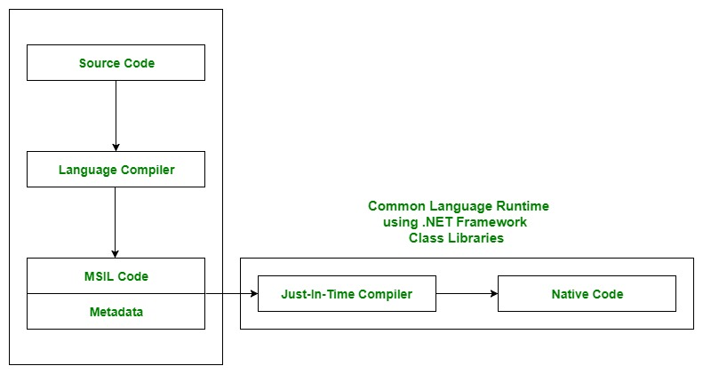

#architecture
# Common Language Runtime (**CLR**)
Es el componente principal de ejecución del ecosistema **.NET**. Es una máquina virtual que gestiona la ejecución de programas desarrollados en lenguajes compatibles con .NET (como `C#`, `F#`, `VB.NET`, etc.).

El ****CLR**** forma parte del ****.NET** Framework**, ****.NET** Core**, y del ecosistema unificado ****.NET**** moderno. Es responsable de proporcionar servicios clave como administración de memoria, ejecución de código, seguridad, manejo de excepciones, y recolección de basura.

## ¿Para qué sirve?
El ****CLR**** sirve como una plataforma de ejecución que abstrae los detalles específicos del hardware y sistema operativo, permitiendo que los desarrolladores escriban código en varios lenguajes de programación sin preocuparse por las complejidades del sistema subyacente.

Esencialmente, el ****CLR****:
* Proporciona un entorno de ejecución seguro y eficiente.

* Permite la interoperabilidad entre múltiples lenguajes dentro del ecosistema **.NET**.

* Simplifica tareas comunes, como la gestión de memoria y manejo de excepciones.

* Mejora el rendimiento y la productividad del desarrollador al encargarse de muchos aspectos complejos del desarrollo.

## ¿Qué resuelve?
El **CLR** resuelve varios problemas relacionados con la ejecución de aplicaciones modernas:

* **Interoperabilidad entre lenguajes**: Permite que diferentes lenguajes de programación trabajen juntos en un solo proyecto. Por ejemplo, una biblioteca escrita en **VB.NET** puede ser utilizada en un proyecto **C#** sin problemas.

* **Manejo de memoria**: Los desarrolladores no necesitan preocuparse por asignar y liberar memoria manualmente. El **CLR** incluye un recolector de basura (Garbage Collector) que gestiona automáticamente la memoria, evitando fugas y sobrecargas.

* **Portabilidad**: El código escrito en lenguajes compatibles con **.NET** se compila a un lenguaje intermedio llamado **CIL (Common Intermediate Language)**, que el **CLR** puede ejecutar en cualquier máquina con un entorno **.NET** compatible.

* **Seguridad**: Proporciona un modelo de seguridad que restringe lo que el código puede hacer, protegiendo el sistema de posibles vulnerabilidades y comportamientos malintencionados.

* **Optimización del rendimiento**: Gracias al compilador **Just-In-Time (JIT)**, el **CLR** traduce el código intermedio en código nativo altamente optimizado para la plataforma en tiempo de ejecución.

* **Manejo robusto de excepciones**: Ofrece una infraestructura estandarizada para capturar y manejar errores, mejorando la estabilidad de las aplicaciones.

## ¿Cómo lo resuelve?
El CLR resuelve los problemas mencionados mediante los siguientes mecanismos clave:

1. **Compilación en dos etapas**:
   * **Compilación previa (`Compile Time`)**: Cuando se compila un programa **.NET**, el código fuente se traduce en **CIL (Common Intermediate Language)**, que se almacena en un ensamblado (`.exe` o `.dll`).

   * **Compilación en tiempo de ejecución (`Runtime`)**: El **CLR** utiliza el compilador **JIT (`Just-In-Time`)** para traducir el **CIL** en código nativo específico de la máquina en la que se está ejecutando el programa.

2. **Recolector de basura (`Garbage Collector`)**: El CLR administra automáticamente la memoria. Libera recursos no utilizados y evita problemas como las fugas de memoria y la fragmentación.

3. **Modelo de seguridad**: Implementa un sistema basado en permisos que controla lo que el código puede y no puede hacer. Por ejemplo, el **CLR** puede restringir el acceso a ciertas áreas del sistema de archivos si el código no tiene permiso.

4. **Soporte para múltiples lenguajes**: Utiliza la **Common Type System (CTS)** y la **Common Language Specification (CLS)** para garantizar que diferentes lenguajes de programación puedan trabajar juntos en el mismo entorno.

5. **Manejo de excepciones**: Proporciona un mecanismo uniforme para manejar errores en tiempo de ejecución mediante bloques `try-catch-finally`.

## Flujo de ejecución en CLR
1. El código fuente (en C#, F#, VB.NET, etc.) se compila en **CIL** (**Common Intermediate Language**).

2. El ensamblado resultante (archivo `.exe` o `.dll`) contiene el **CIL** y **metadatos**.

3. Cuando se ejecuta el programa:
   * El **CLR** carga el ensamblado.

   * El compilador **JIT** convierte el CIL en código nativo.

   * El CLR administra la ejecución del código nativo.

---

