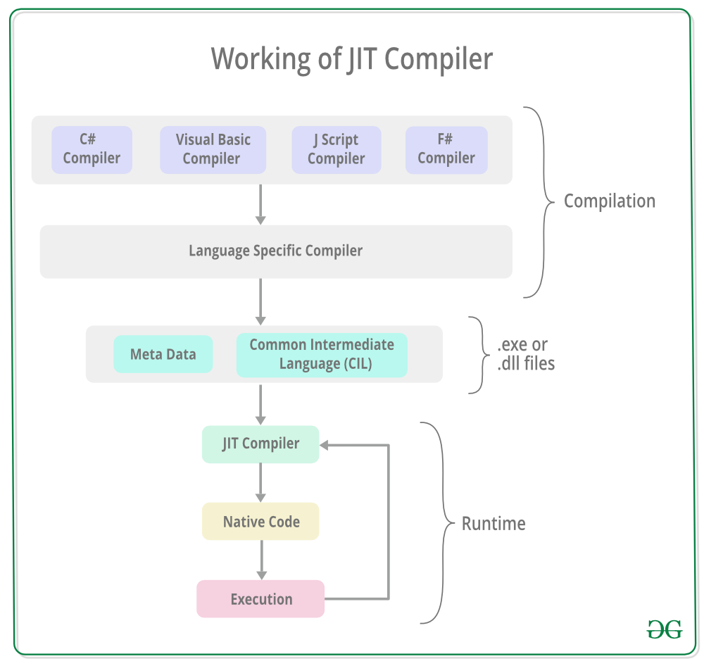

# Just In Time
El Just-In-Time Compiler (JIT) es un componente del Common Language Runtime (CLR) de .NET que convierte el código intermedio (CIL, Common Intermediate Language) en código nativo específico de la máquina en tiempo de ejecución.

El JIT actúa como un puente entre el código independiente de la plataforma generado por el compilador y el código ejecutable optimizado que puede ser entendido por el procesador del sistema.



## ¿Para qué sirve el JIT?
El JIT tiene varios propósitos clave:

* **Conversión de `CIL` a código nativo**: Traduce el CIL en instrucciones que el hardware subyacente pueda entender y ejecutar directamente.

* **Optimización en tiempo de ejecución**: Realiza optimizaciones específicas del entorno de ejecución, como la arquitectura del procesador, el sistema operativo y las condiciones actuales del programa.

* **Gestión de recursos eficiente**: Sólo compila las partes del código que realmente se ejecutan, lo que ahorra tiempo y recursos en comparación con la compilación completa del programa.

* **Soporte para lenguajes gestionados**: Facilita la interoperabilidad de múltiples lenguajes en el ecosistema **.NET**.

## ¿Qué resuelve el JIT?
El JIT aborda los siguientes desafíos:

* **Independencia de la plataforma**: Permite que el mismo ensamblado (.dll o .exe) se ejecute en diferentes arquitecturas, ya que traduce el código intermedio (CIL) a código nativo específico del entorno de ejecución.

* **Eficiencia en la ejecución**: En lugar de compilar todo el programa antes de ejecutarlo, el JIT compila solo las secciones del código que son necesarias, reduciendo la carga inicial.

* **Optimización adaptable**: Se asegura de que el código nativo generado esté optimizado para el hardware y las condiciones específicas del sistema en tiempo de ejecución.

* **Compatibilidad entre lenguajes**: Al usar el CIL como punto intermedio, el JIT hace que los programas escritos en diferentes lenguajes gestionados (.NET) puedan ejecutarse de manera consistente en cualquier entorno que soporte el CLR.

## ¿Cómo lo resuelve el JIT?
El JIT realiza las siguientes acciones para cumplir con su propósito:

1. **Compilación en tiempo de ejecución**:
   * Cuando se llama por primera vez a un método o clase del programa, el CLR invoca al JIT para traducir el CIL correspondiente en código nativo.

   * El código nativo generado se almacena en memoria para que las llamadas posteriores sean rápidas, evitando la recompilación.

2. **Optimización dinámica**:
   * El JIT evalúa el entorno de ejecución (como la CPU disponible) y genera un código nativo altamente optimizado que aprovecha las capacidades específicas del hardware.

   * Realiza optimizaciones como la eliminación de código redundante y el uso de instrucciones de procesador avanzadas.

3. **Segmentación del código**: En lugar de compilar todo el programa de una sola vez, el JIT compila pequeñas porciones (métodos o bloques de código) según sea necesario, lo que reduce la sobrecarga inicial.

4. **Soporte para seguridad**:
   * El JIT realiza verificaciones en tiempo de ejecución para asegurarse de que el código cumple con las reglas de seguridad del CLR.

   * Protege contra manipulaciones no autorizadas o comportamientos inseguros.

## Tipos de compiladores JIT en .NET
El CLR utiliza tres enfoques de compilación JIT, dependiendo del contexto y los requerimientos:

1. **JIT (Compilación Just-In-Time "estándar")**:
   * Compila métodos cuando se ejecutan por primera vez.

   * El código nativo se almacena en memoria y se reutiliza para llamadas futuras.

   * Ofrece un equilibrio entre el tiempo de inicio y la optimización del rendimiento.

2. **Economical JIT**:
   * Diseñado para dispositivos con recursos limitados.

   * Genera código menos optimizado para reducir el uso de memoria y mejorar la velocidad de compilación.

3. **Pre-JIT (Compilación anticipada)**:
   * Utiliza herramientas como NGEN (Native Image Generator) para precompilar el código en CIL a código nativo antes de la ejecución.

   * Reduce los tiempos de inicio al eliminar la necesidad de compilar en tiempo de ejecución.

## Ventajas del JIT
1. **Independencia de la plataforma**: Permite que un solo ensamblado CIL se ejecute en múltiples arquitecturas de hardware.

2. **Optimización en tiempo de ejecución**: Genera código altamente optimizado, adaptado al entorno específico.

3. **Uso eficiente de recursos**: Compila solo las partes del programa que realmente se ejecutan.

4. **Soporte para múltiples lenguajes**: Facilita la interoperabilidad y ejecución de lenguajes gestionados en el ecosistema .NET.

5. **Seguridad**: Verifica el código CIL en tiempo de ejecución, reduciendo vulnerabilidades de seguridad.

## Desventajas del JIT
1. **Retraso inicial**: Durante la primera ejecución, el JIT introduce una pequeña latencia adicional mientras compila el código.

2. **Mayor uso de memoria**: El código nativo generado en tiempo de ejecución consume memoria adicional.

## Proceso de trabajo del JIT
1. El desarrollador escribe el código en un lenguaje como C#.

2. El compilador traduce el código fuente a CIL y lo almacena en un ensamblado (.dll o .exe).

3. Cuando se ejecuta el programa:
   * El CLR carga el ensamblado.

   * El JIT traduce las porciones del CIL en código nativo y las ejecuta.

4. El código nativo se almacena en memoria para ser reutilizado en llamadas posteriores.

### Ejemplo práctico

Código en C#:
```csharp
public class Program
{
    public static void Main()
    {
        Console.WriteLine("Hola, mundo");
    }
}
```
Proceso del JIT:
1. El código C# es compilado a CIL y almacenado en el ensamblado.

2. Durante la ejecución, el CLR invoca al JIT cuando se llama al método Main.

3. El JIT traduce el CIL del método Main en instrucciones nativas que el procesador ejecuta.

### Comparación del JIT con otros métodos de compilación
1. Compilación anticipada (`Ahead-of-Time, AOT`):
   * Compila todo el programa a código nativo antes de la ejecución.

   * Reduce el tiempo de inicio, pero no puede realizar optimizaciones dinámicas.

2. Compilación Just-In-Time (JIT):
   * Compila partes del programa en tiempo de ejecución.

   * Permite optimizaciones adaptativas, pero introduce una latencia inicial.

---
[](CommonIntermediateLanguage.md)