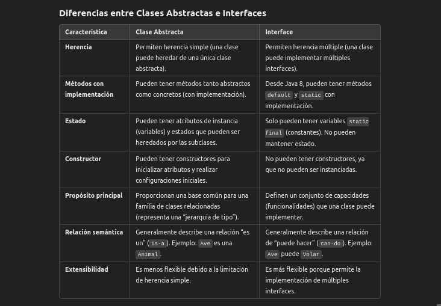

# Clases Abstractas
Las clases abstractas en Java son un tipo especial de clase que no puede instanciarse directamente y que puede contener métodos abstractos (métodos sin implementación) junto con métodos concretos (métodos con implementación). Se usan principalmente para proporcionar una base común para otras clases, permitiéndoles compartir funcionalidad, mientras que cada subclase puede añadir o modificar el comportamiento específico según sus necesidades.

## ¿Qué son las clases abstractas?
Una clase abstracta en Java es una clase que se define con la palabra clave abstract. Esta clase puede contener:

* **Métodos abstractos**: Métodos declarados sin implementación, que obligan a las subclases a proporcionar su propia implementación.

* **Métodos concretos**: Métodos con implementación que pueden ser heredados y reutilizados en las subclases.

Ejemplo básico de clase abstracta:
```java
abstract class Figura {
    abstract double calcularArea();
    public void mostrarTipo() {
        System.out.println("Esta es una figura");
    }
}
```
En este ejemplo, Figura es una clase abstracta con un método abstracto `calcularArea()` y un método concreto `mostrarTipo()`.

## ¿Para qué sirven las clases abstractas?
Las clases abstractas son útiles para:

1. Proporcionar una base común para subclases que comparten cierta funcionalidad.

2. Establecer un contrato parcial (similar a una interfaz), donde solo se define parcialmente el comportamiento de los objetos que hereden de esta clase.

3. **Facilitar la reutilización de código**: los métodos concretos en una clase abstracta pueden ser reutilizados por todas sus subclases.

## ¿Qué resuelven las clases abstractas?
Las clases abstractas permiten:

1. Definir comportamientos comunes en una jerarquía de clases sin tener que implementar los detalles específicos en cada clase individual.

2. Simplificar la implementación de patrones de diseño, como el patrón Template Method, al definir pasos generales en una clase abstracta, mientras que los detalles específicos se implementan en las subclases.

3. Implementar polimorfismo de forma más flexible, permitiendo que las subclases ofrezcan sus propias implementaciones de métodos abstractos, garantizando al mismo tiempo una interfaz de acceso común.

## ¿Cómo resuelven estos problemas?
1. **Definiendo comportamiento común**: Al incluir métodos concretos, una clase abstracta permite que todas las subclases compartan cierta funcionalidad.

2. **Estableciendo un contrato obligatorio parcial**: La presencia de métodos abstractos asegura que las subclases deben proporcionar implementaciones para estos métodos, lo que permite definir una estructura de clase común.

3. **Soporte al polimorfismo**: Las clases abstractas pueden usarse para referenciar sus subclases, lo que facilita que múltiples implementaciones puedan usarse de forma intercambiable mientras cumplen con la estructura de la clase abstracta.

## Ejemplo de Uso de Clases Abstractas en Java
Supongamos que queremos definir varias figuras geométricas que tengan un área. Podemos crear una clase abstracta Figura y hacer que las clases Rectangulo y Circulo la extiendan.

```java
abstract class Figura {
    abstract double calcularArea();
}

class Rectangulo extends Figura {
    private double ancho;
    private double alto;

    public Rectangulo(double ancho, double alto) {
        this.ancho = ancho;
        this.alto = alto;
    }

    @Override
    double calcularArea() {
        return ancho * alto;
    }
}

class Circulo extends Figura {
    private double radio;

    public Circulo(double radio) {
        this.radio = radio;
    }

    @Override
    double calcularArea() {
        return Math.PI * radio * radio;
    }
}
```
En este ejemplo:

* La clase Figura define el método abstracto calcularArea() sin implementación, obligando a Rectangulo y Circulo a proporcionar sus propias versiones del método.

* Figura es un tipo de referencia común para ambos objetos (Rectangulo y Circulo), lo que permite usarlos de manera polimórfica.

## Clases Abstractas vs Interfaces
Las clases abstractas y las interfaces son fundamentales en Java para definir comportamientos comunes y estructurar aplicaciones de forma escalable, pero tienen diferencias clave y sirven a propósitos distintos en la creación de software robusto y mantenible. Te explico las diferencias esenciales y cuándo utilizar cada una.



## ¿Cuándo Usar una Clase Abstracta?
Utiliza una clase abstracta cuando:

1. **Existe una jerarquía clara de objetos** que comparten comportamiento común, y donde las subclases tienen una relación estrecha. Por ejemplo, si tienes una jerarquía Animal > Mamífero > Perro, podrías usar una clase abstracta Animal para métodos y propiedades comunes.

2. **Quieres compartir código entre todas las subclases**. Las clases abstractas permiten definir métodos concretos reutilizables y atributos que pueden ser heredados por las subclases.

3. Deseas aprovechar la encapsulación y control interno del estado mediante el uso de variables de instancia. Esto es útil cuando deseas que el estado sea manejado y compartido solo por la clase abstracta y sus subclases.

4. La funcionalidad básica necesita ser ampliada. Las clases abstractas son excelentes para plantillas (patrón Template Method), donde se define un esqueleto de operaciones que las subclases completarán.

Ejemplo
```java
abstract class Vehiculo {
    String modelo;
    int velocidad;

    Vehiculo(String modelo) {
        this.modelo = modelo;
    }

    void acelerar() {
        System.out.println("El vehículo está acelerando.");
    }

    abstract void frenar(); // Método abstracto, cada vehículo frena de manera distinta
}
```

## ¿Cuándo Usar una Interface?
Usa una interface cuando:

1. Quieres definir un comportamiento común entre clases no relacionadas (como animales y vehículos, que ambos podrían “moverse”).

2. La herencia múltiple de comportamientos es necesaria. En Java, como una clase no puede heredar de más de una clase, las interfaces permiten que una clase implemente múltiples capacidades.

3. No necesitas mantener estado. Las interfaces están diseñadas para definir contratos sin estado; cualquier información compartida debe estar fuera de la interfaz o ser constante.

4. Quieres seguir el Principio de Segregación de Interfaces (ISP) del SOLID. Las interfaces te permiten definir comportamientos específicos y modulares (interfaces pequeñas con un propósito único) para que las clases implementen solo los métodos que realmente necesitan.

Ejemplo
```java
interface Volador {
    void volar();
}

interface Nadador {
    void nadar();
}

class Pato implements Volador, Nadador {
    @Override
    public void volar() {
        System.out.println("El pato está volando.");
    }

    @Override
    public void nadar() {
        System.out.println("El pato está nadando.");
    }
}
```

## Clases Abstractas e Interfaces en el Contexto de SOLID
Las interfaces y las clases abstractas apoyan diferentes principios SOLID, pero funcionan en conjunto para producir código que es modular, extensible y de fácil mantenimiento:

1. Principio de Responsabilidad Única (SRP): Las interfaces ayudan a este principio al permitir que se creen interfaces pequeñas y específicas, de forma que una clase implemente solo las funcionalidades que necesita.

2. Principio de Abierto/Cerrado (OCP): Las clases abstractas permiten que se amplíen comportamientos en subclases sin modificar la clase abstracta original, manteniendo el código abierto para extensión y cerrado para modificación.

3. Principio de Sustitución de Liskov (LSP): Las clases abstractas permiten que cualquier subclase pueda sustituir a la clase abstracta sin romper la aplicación, siempre que respete el contrato de la clase abstracta.

4. Principio de Segregación de Interfaces (ISP): Las interfaces, al ser divididas en interfaces pequeñas, aseguran que una clase implemente solo los métodos que necesita, lo que evita implementaciones innecesarias.

5. Principio de Inversión de Dependencias (DIP): Las interfaces permiten que las clases dependan de abstracciones en lugar de implementaciones concretas, aumentando la flexibilidad y el desacoplamiento del sistema.

## Ejemplo Práctico: Sistema de Pago
Imagina un sistema de pago donde tienes múltiples métodos de pago, cada uno con su propia implementación:

1. Usa una clase abstracta MetodoPago para implementar funcionalidades comunes, como verificar si un pago es válido.

2. Usa interfaces PagoOnline y PagoPresencial para métodos específicos que solo algunos métodos de pago necesitan implementar.

```java
abstract class MetodoPago {
    String nombreCliente;

    MetodoPago(String nombreCliente) {
        this.nombreCliente = nombreCliente;
    }

    abstract void realizarPago(double cantidad);

    void imprimirRecibo() {
        System.out.println("Imprimiendo recibo para " + nombreCliente);
    }
}

interface PagoOnline {
    void autenticarUsuario();
}

interface PagoPresencial {
    void aplicarDescuento();
}

class TarjetaCredito extends MetodoPago implements PagoOnline {
    TarjetaCredito(String nombreCliente) {
        super(nombreCliente);
    }

    @Override
    void realizarPago(double cantidad) {
        autenticarUsuario();
        System.out.println("Pago realizado con tarjeta de crédito por " + cantidad);
    }

    @Override
    public void autenticarUsuario() {
        System.out.println("Autenticando usuario...");
    }
}

class Efectivo extends MetodoPago implements PagoPresencial {
    Efectivo(String nombreCliente) {
        super(nombreCliente);
    }

    @Override
    void realizarPago(double cantidad) {
        System.out.println("Pago en efectivo de " + cantidad);
    }

    @Override
    public void aplicarDescuento() {
        System.out.println("Aplicando descuento por pago en efectivo...");
    }
}
```

## ¿Cómo Decidir Cuándo Usar Clases Abstractas o Interfaces?
1. Si necesitas definir un comportamiento con estado compartido: Usa una clase abstracta.

2. Si quieres extender funcionalidades sin atarte a una jerarquía de herencia rígida: Usa interfaces para que tus clases puedan implementar múltiples comportamientos sin limitaciones.

3. Si estás siguiendo SOLID:
   * Si aplicas el Principio de Segregación de Interfaces, usa interfaces.

   * Para el Principio de Abierto/Cerrado y Sustitución de Liskov, considera clases abstractas si es necesaria una estructura de clase común.
