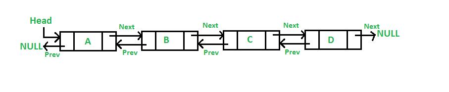

# Double Linked List
Es una estructura de datos lineal compuesta por nodos, donde cada nodo tiene dos punteros o referencias:

* **`prev`**: apunta al nodo anterior.
* **`next`**: apunta al nodo siguiente.

```bash
null <- [A] <-> [B] <-> [C] -> null
```


A diferencia de una lista simplemente enlazada (que solo pueden moverse en una dirección.), una **DLL** permite:
* Recorrer hacia adelante (`next`)
* Recorrer hacia atrás (`prev`)

## ¿Para qué sirve?
Se usa cuando necesitas:

* **Búsquedas o recorridos en ambas direcciones**
  * Ejemplo: iteradores bidireccionales.

* **Eliminaciones o inserciones rápidas en medio de la lista**
  * En una lista simplemente enlazada necesitas recorrer desde el inicio para encontrar el nodo anterior. **En una DLL ya lo tienes con `prev`.**

* **Estructuras que dependen de mover nodos frecuentemente**
  * Ejemplos:
    * Implementación de LRU Cache
    * Árboles B (sus listas internas son DLL)
    * Navegación adelante/atrás (deshacer/rehacer)
    * Listas circulares eficientes

* **Representar datos donde saltar atrás sea importante**
  * Como un editor de texto, donde el cursor debe moverse a izquierda y derecha.

## ¿Cuál es su estructura interna?
Un nodo típico se ve así:

```java
class Node {
    int data;
    Node next;
    Node prev;

    Node(int data) {
        this.data = data;
    }
}
```
Y la lista suele tener:
```java
class DoublyLinkedList {
    private Node head;  // primer nodo
    private Node tail;  // último nodo
    private int size;
}
```
Memoria Interna -> Cada nodo ocupa más memoria que en una lista simple:
```bash
[ int data ][ pointer prev ][ pointer next ]
```
Pero esa memoria extra permite operaciones más rápidas.

## ¿Qué resuelven?
1. **Eliminación rápida de un nodo**
   * En una lista simplemente enlazada, para eliminar un nodo necesitas -> saber quién es su anterior
     * En una **DLL** ya lo tienes en `prev`.

   * Eliminar un nodo es O(1):
```java
node.prev.next = node.next
node.next.prev = node.prev
```

2. **Inserciones rápidas en mitad de la lista**
   * Igual que arriba: `O(1)`.
   * En una singly linked list → `O(n)` solo para llegar al nodo previo.

3. **Recorridos bidireccionales** -> Muy útil para navegadores, reproductores, sistemas de historial, etc.

### Casos de uso
* Historial de navegación en navegadores (ir hacia atrás o adelante).

* Reproductores multimedia (siguiente y anterior canción).

* Gestión de memoria en SO (manejo de procesos y paginación).

* Edición de documentos con deshacer/rehacer (CTRL + Z, CTRL + Y).

## Estructura de una Double Linked List
Un nodo de una lista doblemente enlazada tiene tres componentes:
1. Dato: Información almacenada en el nodo.

2. Puntero al nodo anterior (prev).

3. Puntero al nodo siguiente (next).

**Ejemplo en Java:**
```java
class Nodo {
    int dato;
    Nodo prev;  // Puntero al nodo anterior
    Nodo next;  // Puntero al nodo siguiente

    public Nodo(int dato) {
        this.dato = dato;
        this.prev = null;
        this.next = null;
    }
}
```
Ejemplo visual en memoria:
```rust
NULL ← [ 5 | * | * ] ↔ [ 10 | * | * ] ↔ [ 15 | * | NULL ]
```
Aquí, prev apunta al nodo anterior y next al siguiente.

## ¿Qué problemas resuelve una Double Linked List?
* Navegación en ambas direcciones, útil para muchas aplicaciones.

* Eliminación más eficiente, ya que cada nodo tiene un enlace al anterior.

* Mayor flexibilidad para reordenar elementos sin recorrer toda la lista.

* Mejor rendimiento en ciertas operaciones en comparación con listas simples.

## Implementación
```java
class Nodo {
    int dato;
    Nodo prev, next;

    public Nodo(int dato) {
        this.dato = dato;
        this.prev = null;
        this.next = null;
    }
}

class ListaDoble {
    Nodo cabeza;

    // Método para agregar un nodo al inicio
    public void agregarAlInicio(int dato) {
        Nodo nuevo = new Nodo(dato);
        if (cabeza != null) {
            nuevo.next = cabeza;
            cabeza.prev = nuevo;
        }
        cabeza = nuevo;
    }

    // Método para imprimir la lista en orden normal
    public void imprimirLista() {
        Nodo temp = cabeza;
        while (temp != null) {
            System.out.print(temp.dato + " ↔ ");
            temp = temp.next;
        }
        System.out.println("NULL");
    }

    public static void main(String[] args) {
        ListaDoble lista = new ListaDoble();
        lista.agregarAlInicio(10);
        lista.agregarAlInicio(20);
        lista.agregarAlInicio(30);
        lista.imprimirLista();
    }
}
```
Salida
```bash
30 ↔ 20 ↔ 10 ↔ NULL
```
Aquí agregamos elementos al inicio, por lo que el último agregado es el primero en la lista.

## Métodos adicionales en una Double Linked List
Agregar al final
```java
public void agregarAlFinal(int dato) {
    Nodo nuevo = new Nodo(dato);
    if (cabeza == null) {
        cabeza = nuevo;
        return;
    }
    Nodo temp = cabeza;
    while (temp.next != null) {
        temp = temp.next;
    }
    temp.next = nuevo;
    nuevo.prev = temp;
}
```
Complejidad: O(n) (se recorre la lista para encontrar el último nodo).

Buscar un elemento
```java
public boolean buscar(int dato) {
    Nodo temp = cabeza;
    while (temp != null) {
        if (temp.dato == dato) {
            return true;
        }
        temp = temp.next;
    }
    return false;
}
```
Complejidad: O(n) (hay que recorrer toda la lista en el peor caso).

Eliminar un nodo específico
```java
public void eliminar(int dato) {
    if (cabeza == null) return;

    Nodo temp = cabeza;
    
    while (temp != null && temp.dato != dato) {
        temp = temp.next;
    }

    if (temp == null) return; // Nodo no encontrado

    if (temp.prev != null) {
        temp.prev.next = temp.next;
    } else {
        cabeza = temp.next; // Si es el primer nodo
    }

    if (temp.next != null) {
        temp.next.prev = temp.prev;
    }
}
```
Complejidad: O(n) (en el peor caso hay que recorrer toda la lista).