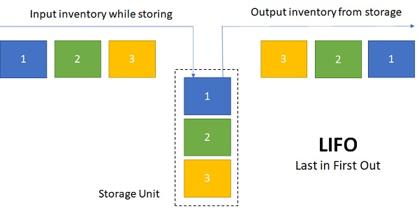

# First In, First Out
FIFO (First In, First Out) es una estructura de datos en la que el primer elemento en entrar es el primero en salir. Funciona como una fila de personas en una caja de supermercado: quien llega primero es atendido primero.

**Ejemplo del mundo real:**
* Una fila en un banco o supermercado.

* Un ascensor con límite de capacidad: la primera persona que entró es la primera en salir.

**Ejemplo en programación:**
* Un servidor de impresión maneja los trabajos de impresión en orden de llegada.

* Un buffer de red transmite paquetes en el mismo orden en que llegaron.

La estructura de datos FIFO (First In, First Out) es un principio fundamental en informática y programación, utilizado en colas (queues), buffers y sistemas de gestión de procesos.

## ¿Para qué sirve FIFO?
* Gestión de procesos en sistemas operativos: Las colas de procesos en un sistema operativo siguen el principio FIFO para ejecutar tareas en orden de llegada.

* Manejo de colas en estructuras de datos: Se usa en colas (queues) en programación para modelar sistemas de espera.

* Transmisión de datos en redes y buffers: Los datos enviados a través de redes o en procesamiento de señales siguen FIFO.

* Algoritmos de planificación en sistemas operativos: En planificación de CPU, algunos algoritmos usan FIFO para decidir qué proceso se ejecutará a continuación.

* Sistemas de almacenamiento y bases de datos: En sistemas de almacenamiento, los discos pueden manejar las solicitudes en orden FIFO.

## ¿Cuál es su estructura?
FIFO se implementa mediante una cola (queue), que tiene dos operaciones principales:

* **`Enqueue` (encolar)** → Agrega un elemento al final de la cola.

* **`Dequeue` (desencolar)** → Remueve el primer elemento de la cola.

