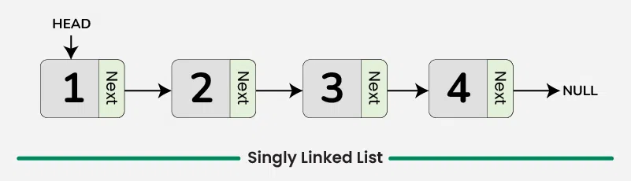

# Linked List
Una lista enlazada es una estructura de datos **dinámica**, formada por nodos conectados entre sí por referencias (punteros).

Cada nodo tiene, al menos:
```bash
[data | next]
```
Es decir:
* **`data`** → el valor almacenado

* **`next`** → un puntero al siguiente nodo de la lista

La lista comienza en un puntero llamado **`head`**. Ejemplo conceptual:
```bash
head → [ 5 | * ] → [ 8 | * ] → [ 13 | * ] → NULL
```



## ¿Cuál es su estructura interna?
Las listas enlazadas son primitivas compuestas por:

1. **Nodo (unidad básica)**
```java
class Node {
    int data;
    Node next;
}
```
2. **Referencia al primer nodo (`head`)**
```bash
Node head;   // Java (referencia)
```
3. **Longitud (opcional)** -> Algunas implementaciones trackean el tamaño.

## ¿Qué problema resuelven?
Las listas enlazadas resuelven una limitación fundamental de los arrays: *El tamaño del arreglo es fijo y las inserciones/eliminaciones son costosas porque implican mover elementos.*

* **Problemas reales que resuelve una lista enlazada:**
  * crecimiento dinámico sin necesidad de reservar memoria contigua
  * inserciones y eliminaciones rápidas en cualquier posición
  * estructura flexible sin realocaciones de memoria
  * operaciones de concatenación O(1)
  * nodos distribuidos en cualquier parte del heap

## ¿Cómo lo resuelve?
Mediante:

* **nodos independientes** -> cada nodo se almacena donde haya memoria disponible (no contigua).

* **enlaces (punteros) entre nodos** -> así se mantiene la secuencia.

* **punteros que pueden cambiar dinámicamente** -> agregar o remover un nodo solo implica cambiar 1–2 enlaces.

### Complejidad de las operaciones
| Operación                    | Complejidad |
| ---------------------------- | ----------- |
| Insertar al inicio           | O(1)        |
| Insertar al final (sin tail) | O(n)        |
| Insertar al final (con tail) | O(1)        |
| Eliminar al inicio           | O(1)        |
| Eliminar en medio            | O(1)        |
| Buscar por índice            | O(n)        |
| Buscar por valor             | O(n)        |

**Por qué no O(1) al final siempre? -> Porque debes recorrer la lista para encontrar el último nodo si no tienes un puntero `tail`.**


### ¿Por qué es tan importante aprender listas enlazadas?
Porque son necesarias para entender:

* colas (queues)
* pilas (stacks)
* tablas hash (manejo de colisiones con listas)
* árboles (nodos + enlaces)
* tries
* grafos
* skip lists
* observadores en sistemas
* estructuras del kernel

**Si no dominas nodos + punteros → no puedes dominar lo avanzado.**

## Ventajas y desventajas
* **Ventajas**
  * crecimiento dinámico
  * inserciones/eliminaciones eficientes
  * no requiere memoria contigua
  * ideal para estructuras dinámicas complejas
  * modificar referencias es barato

* **Desventajas**
  * acceso secuencial (no acceso aleatorio)
  * búsqueda lenta
  * mayor overhead de memoria (punteros)
  * menos amigable con cache de CPU

## ¿Cuándo usar una lista enlazada?
* **Úsala cuando**:
  * necesites muchas inserciones/eliminaciones en medio
  * los datos crecen o se reducen dinámicamente
  * no necesitas acceso por índices rápido
  * la memoria puede estar fragmentada
  * construyes estructuras más complejas (árboles, colas, grafos)

* **No usarla cuando**:
  * necesitas acceso rápido por índice
  * el tamaño es fijo
  * la cache de CPU importa mucho
  * el número de elementos es pequeño (ArrayList gana)